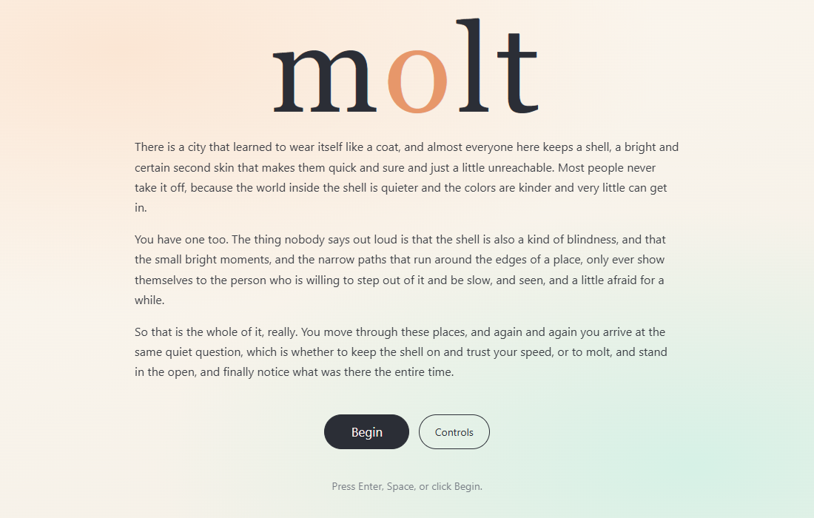
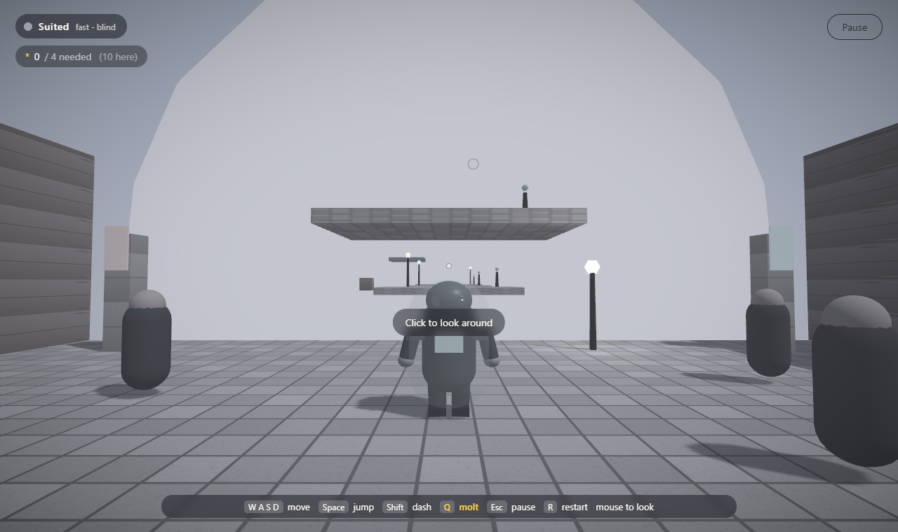
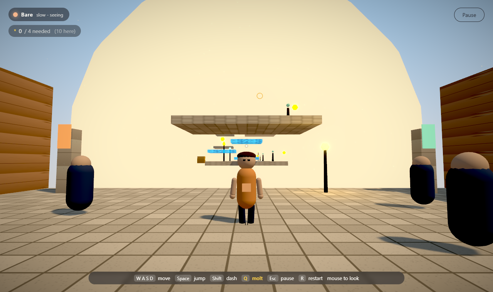

# Molt

A 3D puzzle platformer about precise movement, and about when to take your armor off. You run, jump, and dash through hand-built zones, switching between two states, **suited** and **bare**, to cross gaps, reveal hidden paths, and solve traversal puzzles.

Here's the twist. Suited, you're fast and armored, but the world is muted and some parts of the level are simply invisible to you. Bare, you're slower and exposed, but the world floods with color and sound, hidden platforms appear, and collectible "moments" come into view. So the whole game is really one question, asked over and over: *when do you wear the shell, and when do you step out of it?*

I built Molt in the same world and mood as a separate visual-novel project of mine (suits as masks, the quiet power of just being present), but it stands on its own as a movement game. If you want a sense of the feeling I was going for: A Short Hike, Mushishi, Kentucky Route Zero.

🌐 **Play it live:** [molt-one.vercel.app](https://molt-one.vercel.app/)



The core mechanic, in one image. Same spot, same platforms, two states:

| Suited (fast, blind) | Bare (slow, seeing) |
|---|---|
|  |  |

## Run it

```bash
npm install
npm run dev        # http://localhost:5173
```

Static production build (drop `dist/` on any static host):

```bash
npm run build      # tsc -b && vite build
npm run preview
```

## Controls

| Action | Binding |
|---|---|
| Move | `W A S D` or arrow keys |
| Look / camera | click the game to capture the cursor, then move the mouse (Esc releases) |
| Jump | `Space` (double-jump while suited) |
| Dash | `Shift` (suited only, short cooldown) |
| Switch state (molt) | `Q` or `E` |
| Pause | `Esc` or `P` |
| Restart zone | `R` |
| Back to the map | `M`, or from the pause menu |

The title screen opens on the story; the controls list is one click away there and always in the pause menu. It's keyboard and mouse only, no gamepad support yet.

## The core mechanic: the Shell

One toggle, a real trade-off both ways. The cost of being suited isn't a timer ticking down. It's that you literally can't see the solution.

| | Suited | Bare |
|---|---|---|
| Speed | fast, plus dash and double-jump | slower, single jump |
| Hazards | armored, push through | vulnerable (exposure drains in gusts) |
| The world | desaturated, muffled, some parts invisible | color and sound flood in, hidden platforms appear, "moments" become collectible |

### The transition is reversible (and not exploitable)

Pressing `Q` doesn't snap between states, it drives a transition. Picture a slider that runs from `0` (bare) to `1` (suited):

- `Q` starts moving progress toward the opposite state, with a visible morph between the two looks (the suit assembles, or sheds).
- Tap `Q` again mid-transition and it reverses smoothly from wherever it is. No snapping, no waiting for it to finish, no double-trigger weirdness.
- The committed state only flips when progress actually reaches an end (`0` or `1`). Crucially, **your abilities stay on the current committed state for the whole transition**, so you can't half-toggle to steal a target state's powers early. The HUD shows the live percent and which ability set is active while you morph.

## Movement feel

The character uses Rapier's kinematic character controller with per-axis move-and-slide, so movement stays crisp and predictable:

- **Walls don't kill your jump.** Horizontal and vertical motion resolve independently. Bump a side wall while rising and you keep rising, sliding up the wall. Only a real ceiling stops upward motion, only the ground stops downward.
- Fairly strong gravity (little float), snappy jumps, instant horizontal response.
- Coyote time, a suited double-jump, and a suited dash burst (the dash keeps your vertical velocity, so you can dash across mid-air).
- No physics jitter, sticking, or launching against walls.

## Character and animation

The player is a small procedurally-animated rig (no external model files) with real states: idle, walk/run (speed-blended), jump takeoff, airborne rise and fall, a landing squash, and a victory pose on level complete. The two states are genuinely different shapes, not just a different color. Bare is a lean, simple figure; suited is a bulkier armored shell with a back pack and a glowing chest panel. They cross-fade as the Shell transition plays.

## Secondary mechanics

- **Moments**: glowing collectibles only visible (and collectible) while bare. Each zone has a minimum you must gather before the goal opens, and most sit off the path, so noticing and detouring is rewarded.
- **Hidden platforms**: stepping stones you can only see, and only stand on, while bare.
- **CARAPACE Mk.III**: the suit narrates the first zones like a dry, matter-of-fact instruction manual, with lines scripted to where you are and what you're doing. It teaches one verb at a time and is faintly proud of you.
- **Gusts**: being bare in a gust drains *exposure*. Empty it and you're forced back into the suit (a gentle reset, never a death).
- **The color flood**: a custom postprocessing grade (desaturate plus bloom) sells the suited-vs-bare shift. The suit is also a real audio low-pass filter that opens when you go bare, and a hummed melody fades in.
- Planned: a sticker/decoration system with real effects and crowd-blend, rain that boosts bare perception, the melody as a collectible, and ants that guide you as part of the world itself.

## Zones (a hub plus 5, each its own palette and twist)

| Zone | Twist | Status |
|---|---|---|
| The Trend Mile | the tutorial obby: teaches the molt-switch (suited reach vs bare-only planks) and the double-jump, ending with a mid-air molt and a turning climb to a high, offset goal | **playable** |
| The Glasshouse | the challenge obby in the rain: harder shapes, a 9 m double-jump gap, bare-only water routes, a timed-molt plank stack, and an expert double-jump plus mid-air molt leap | **playable** |
| The Underhum | trade your suit-light for the glow only stillness shows | planned |
| The Gallery of Faces | wear the right face to pass, then take it off | planned |
| The Open Field | no suit to help you, just the air | planned |

## Tech stack

| Layer | Choice |
|---|---|
| 3D / rendering | [Three.js](https://threejs.org) `0.184` via [React-Three-Fiber](https://r3f.docs.pmnd.rs) `9` |
| Build / dev | [Vite](https://vite.dev) `8` + TypeScript `6` (ships as static files) |
| Physics | [Rapier](https://rapier.rs) via `@react-three/rapier` `2` (WASM), kinematic character controller |
| Post-processing | `@react-three/postprocessing` `3` (custom desaturation grade + bloom) |
| State | [Zustand](https://zustand.docs.pmnd.rs) `5`, progress persisted to `localStorage` |
| Audio | Web Audio API, hand-written procedural engine (no audio files): an ambient pad through a low-pass "suit filter" plus a hummed melody |
| Tests | Puppeteer headless smoke + physics checks (`scripts/`) |

Everything renders from code and primitives. No external 3D models, textures, or audio files. Surface textures (tile, panel, glass, water, soil) and their bump maps are generated once to a canvas at load. A downloadable desktop build via Tauri is on the someday list.

## Project layout

```
src/
  game/        store (zustand: screens, suit transition, pause, run id),
               input (keyboard + pointer lock), shared per-frame refs (fx)
  audio/       procedural Web Audio engine
  zones/       zone metadata + The Trend Mile geometry
  components/  Game (Canvas), Player (kinematic controller + animated rig + camera),
               PostFX (the flood), SceneRig, SkyDome, Particles, gameplay entities
  ui/          TitleScreen (intro + controls), ControlsGuide, LevelSelect,
               HUD, PauseMenu, CompleteScreen
scripts/
  verify.mjs        headless smoke test (loads the game, checks console, saves shots)
  verify-wall.mjs   headless physics test for per-axis wall collision
```

Adding a zone: add an entry to `src/zones/zones.ts`, build its geometry component (model it on `TrendMile.tsx`), and wire it into `src/components/Game.tsx` with a palette config. See [docs/BUILDING_LEVELS.md](docs/BUILDING_LEVELS.md) for the full level-authoring guide.

## Verify

```bash
npm run dev               # one terminal
node scripts/verify.mjs   # smoke test + screenshots (shot-suited.png, shot-bare.png)
node scripts/verify-wall.mjs   # confirms jumping into a wall preserves vertical momentum
```
